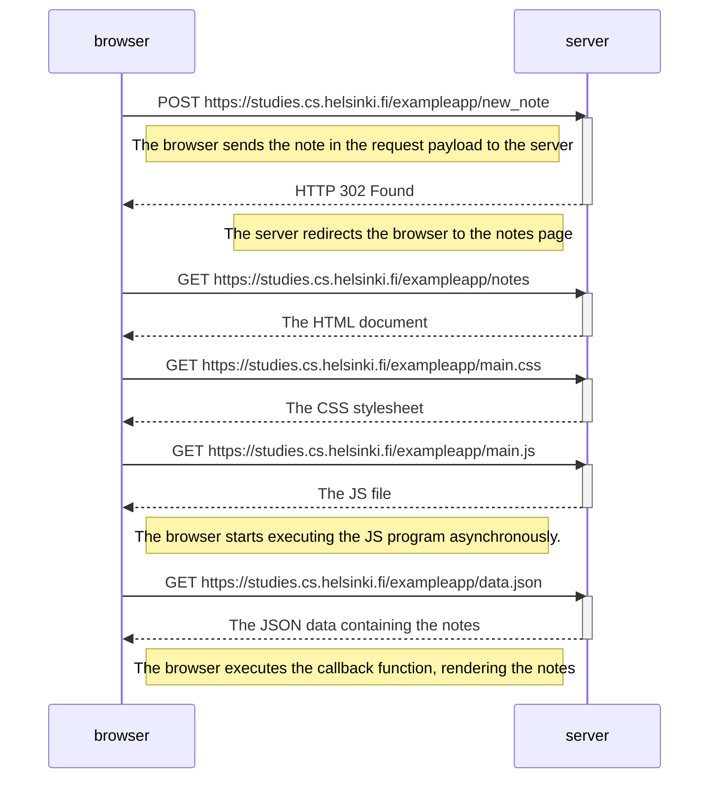

Sequence diagram for creating a new note in the example app (traditional + AJAX version):

```mermaid
sequenceDiagram
    participant browser
    participant server
    
    browser->>server: POST https://studies.cs.helsinki.fi/exampleapp/new_note
    activate server

    Note right of browser: The browser sends the note in the request payload to the server

    server-->>browser: HTTP 302 Found
    deactivate server

    Note left of server: The server redirects the browser to the notes page

    browser->>server: GET https://studies.cs.helsinki.fi/exampleapp/notes
    activate server
    server-->>browser: The HTML document
    deactivate server

    browser->>server: GET https://studies.cs.helsinki.fi/exampleapp/main.css
    activate server
    server-->>browser: The CSS stylesheet
    deactivate server

    browser->>server: GET https://studies.cs.helsinki.fi/exampleapp/main.js
    activate server
    server-->>browser: The JS file
    deactivate server

    Note right of browser: The browser starts executing the JS program asynchronously.

    browser->>server: GET https://studies.cs.helsinki.fi/exampleapp/data.json
    activate server
    server-->>browser: The JSON data containing the notes
    deactivate server

    Note right of browser: The browser executes the callback function, rendering the notes 
```