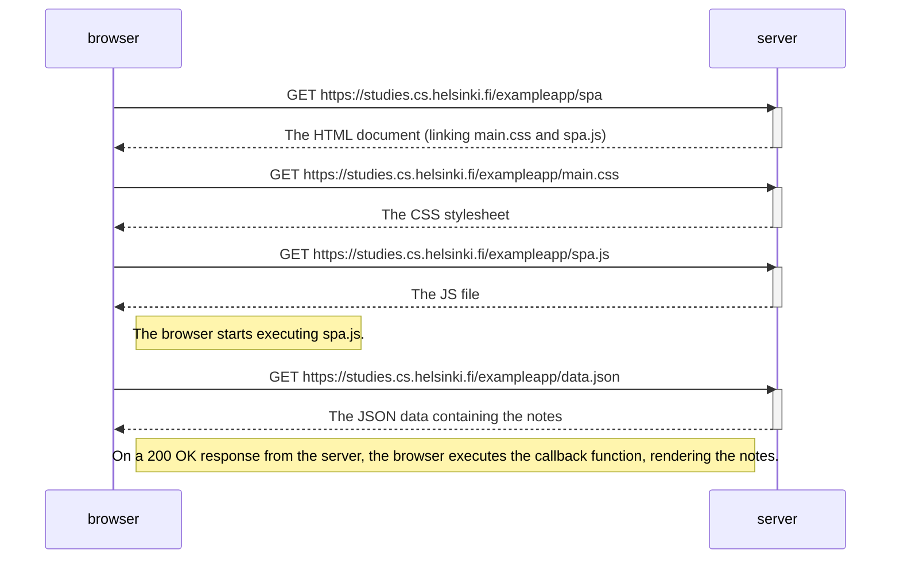

Sequence diagram for opening the *notes* page in the SPA version of the example app:

```mermaid
sequenceDiagram
    participant browser
    participant server

    browser->>server: GET https://studies.cs.helsinki.fi/exampleapp/spa
    activate server
    server-->>browser: The HTML document (linking main.css and spa.js)
    deactivate server

    browser->>server: GET https://studies.cs.helsinki.fi/exampleapp/main.css
    activate server
    server-->>browser: The CSS stylesheet
    deactivate server

    browser->>server: GET https://studies.cs.helsinki.fi/exampleapp/spa.js
    activate server
    server-->>browser: The JS file
    deactivate server

    Note right of browser: The browser starts executing spa.js.

    browser->>server: GET https://studies.cs.helsinki.fi/exampleapp/data.json
    activate server
    server-->>browser: The JSON data containing the notes
    deactivate server

    Note right of browser: On a 200 OK response from the server, the browser executes the callback function, rendering the notes.
```