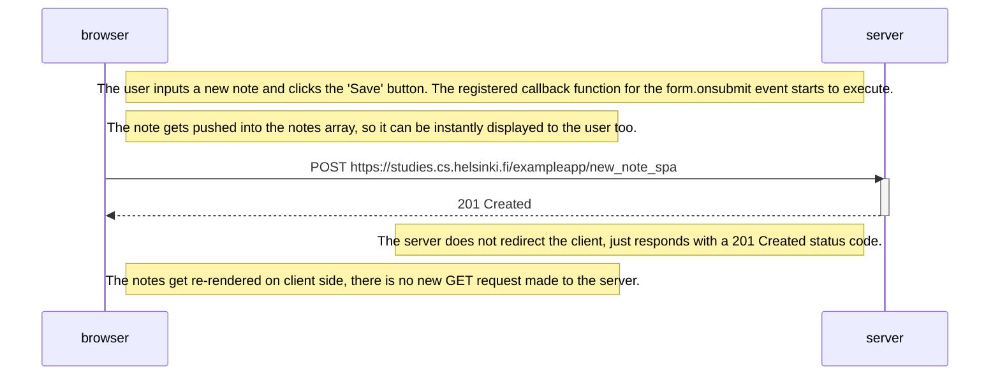

Sequence diagram for *posting a new note* in the SPA version of the example app:

```mermaid
sequenceDiagram
    participant browser
    participant server

    Note right of browser: The user inputs a new note and clicks the 'Save' button. The registered callback function for the form.onsubmit event starts to execute.

    Note right of browser: The note gets pushed into the notes array, so it can be instantly displayed to the user too.

    browser->>server: POST https://studies.cs.helsinki.fi/exampleapp/new_note_spa
    activate server
    server-->>browser: 201 Created
    deactivate server

    Note left of server: The server does not redirect the client, just responds with a 201 Created status code.
    
    Note right of browser: The notes get re-rendered on client side, there is no new GET request made to the server.
```